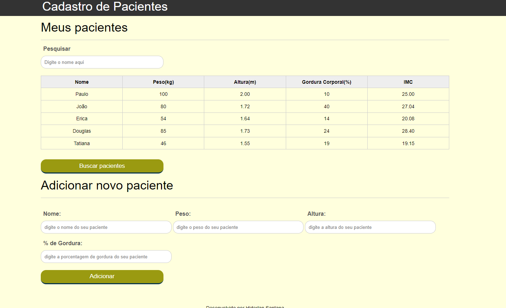

# projeto-tabela-imc

## Visão Geral

### Projeto de uma aplicação Web que simula o cadastro de dados de pacientes de um consultorio médico nutricionista.

#

⏳ Projeto realizado em 6 dias.
#
## Construido com:
- HTML
- CSS
- JavaScript

## Funcionalidades
- Cadastro de novos pacientes
- Exlcusão de pacientes com duplo click na linha da tabela que deseja excluir
- Filtro de pesquisa
- Busca de pacientes via API

## O que eu aprendi:
- Manipulação do DOM
- Arrays, loops e estilos
- Eventos
- AJAX
- Boas práticas com JavaScript

## Link

Veja o projeto aqui: 

## Autor

Hiderlan Santana: [Linkedin](https://www.linkedin.com/in/hiderlan-santana/)

